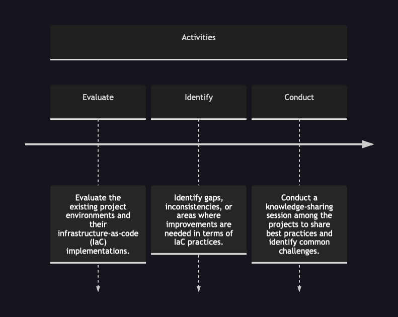

**Milestone 1: Assess Current Project Environments and IaC Implementation**

- Evaluate the existing project environments and their infrastructure-as-code (IaC) implementations.
- Identify gaps, inconsistencies, or areas where improvements are needed in terms of IaC practices.
- Conduct a knowledge-sharing session among the projects to share best practices and identify common challenges.

**Milestone 2: Define Standardized IaC Practices and Tooling**

- Collaboratively define standardized IaC practices, including naming conventions, directory structure, module organization, and version control workflows.
- Select and implement a centralized version control system, such as Git, to manage the IaC codebase across projects.
- Identify and select suitable tools for managing and deploying infrastructure, such as Terraform, across all projects.

**Milestone 3: Establish Infrastructure Automation and CI/CD Pipelines**

- Implement or enhance existing infrastructure automation using Terraform or similar tools to enable consistent and repeatable infrastructure provisioning.
- Develop standardized CI/CD pipelines using tools like GitHub Actions, focusing on automating infrastructure deployments, code testing, and application deployments.
- Enable automated environment creation and management, allowing project teams to provision and manage their development, staging, and production environments easily.

**Milestone 4: Implement Shared Service Offerings and Internal Developer Platform**

- Identify common services required by multiple projects, such as authentication, logging, monitoring, and database management.
- Build shared service offerings, using tools like Kubernetes, Istio, or service mesh, to provide these services consistently across projects.
- Develop an Internal Developer Platform (IDP) that abstracts the complexity of managing these services, allowing application teams to self-service and integrate them easily.

**Milestone 5: Knowledge Sharing and Training Programs**

- Conduct regular knowledge-sharing sessions and workshops to spread awareness and educate project teams about platform engineering practices and tools.
- Offer training programs on IaC, infrastructure management, CI/CD, and other relevant topics to enhance the skills and knowledge of project teams.
- Encourage collaboration and cross-team learning by facilitating sharing of experiences and solutions.

**Milestone 6: Continuous Improvement and Feedback Loop**

- Establish a feedback mechanism to gather input from project teams about the effectiveness and usability of the platform engineering initiatives.
- Regularly review and iterate on the platform engineering practices, tools, and processes based on feedback and evolving project requirements.
- Foster a culture of continuous improvement by encouraging all team members to contribute ideas and suggestions for enhancing the platform.

Remember to adapt these milestones to fit the specific needs and challenges of your organization. Assign responsible individuals or teams for each milestone and establish a timeline with achievable goals. Regularly track progress, hold discussions, and adjust the plan as needed to ensure successful implementation of the platform engineering initiatives.
